# YAPA Foundation-First Architecture and Code Audit

**Status:** Draft for owner review

**Audit date:** 2026-08-11

**Code baseline:** `0093f21` on `master`

**Product baseline:** v0.1.8

**Audit method:** Source review, test review, CI review, documentation review, and primary-source benchmark research

## 1. Executive verdict

YAPA has a sound v0.1 base. The code is small, readable, typed, and well tested for its current behavior. The provider layer has useful shared code. The service layer also gives the project a better base than a route-driven prototype.

YAPA is not ready for tool execution yet. The current system is a streaming chat backend. It does not yet have the durable run model, security boundary, state machine, or storage rules that an agent runtime needs.

One current defect can delete JSON files outside the session directory. Several other defects can lose conversation updates, ignore injected configuration, or expose secrets. These defects need fixes before v0.2 starts.

The main recommendation is a modular monolith with ports and adapters. YAPA does not need microservices. It needs stronger internal boundaries and explicit domain state.


### 1.1 Release decision

Do not add executable tools to the current `ChatService`. First, create a durable run model and a backend policy-enforcement point.

### 1.2 Highest-priority work

1. Fix the storage path traversal defect.
2. Stop the CLI from printing secrets.
3. Make sure the app uses the supplied configuration.
4. Run CI for pull requests to `development`.
5. Define run, event, tool-call, and approval state.
6. Separate WebSocket lifetime from run lifetime.
7. Add local authentication and WebSocket origin controls before tools ship.
8. Add storage versioning and concurrency rules.

## 2. Product target used for this audit

YAPA is a local-first personal agent backend. It supplies agent behavior to custom frontends. The future built-in user interface must use the same public API as other frontends.

The target installation supports Windows and Ubuntu. A typical host has six CPU cores, 16 GB of RAM, and 4 GB of VRAM. YAPA can run beside Ollama, LM Studio, or vLLM. YAPA must leave most compute resources for those model runtimes.

The backend owns all security decisions. A frontend can show an approval request, but it cannot bypass or grant hidden authority.

The long-term product supports these capabilities:

- Tool execution and approval gates
- Searchable conversation history
- Durable user facts and preferences
- Semantic document retrieval
- Scheduled and background work
- Multi-step planning
- Subagents
- Concurrent runs from multiple clients
- LAN and remote clients

Python and `uv` are fixed choices. The project can change other libraries and internal designs.

## 3. Audit scope and rating model

This audit covers the tracked repository. It does not test live provider accounts or external model quality.

| Rating | Meaning |
|---|---|
| Critical | The defect can cause direct data loss or a major security failure. |
| High | The defect blocks a safe v0.2 release or breaks a core contract. |
| Medium | The defect creates material reliability, maintenance, or scale risk. |
| Low | The defect reduces clarity or quality but does not block the next release. |

The report uses two types of finding:

- **Current defect:** Current code can fail now.
- **Architecture blocker:** Current behavior is acceptable for chat, but it cannot safely support a planned capability.

## 4. Current baseline

The documented quality gate passes:

- Ruff lint: pass
- `ty` type check: pass
- Pytest: 346 tests pass
- Statement coverage: 94.57 percent
- Windows and Ubuntu CI jobs exist

The format check does not pass. Ruff reports 12 files that need formatting. The CI gate does not run `ruff format --check`.

### 4.1 What is already good

- The repository uses a `src` layout and a committed `uv.lock` file.
- The application uses a factory instead of a global FastAPI app.
- Provider errors use a common exception family.
- Provider initialization can fail independently.
- Pydantic models define the current wire data.
- The test suite covers most current branches.
- Windows and Ubuntu run in the CI matrix.
- The project has clear contributor commands.
- The default server bind is loopback.

These choices are worth keeping. The next redesign should refine them, not discard them.

### 4.2 Current request flow

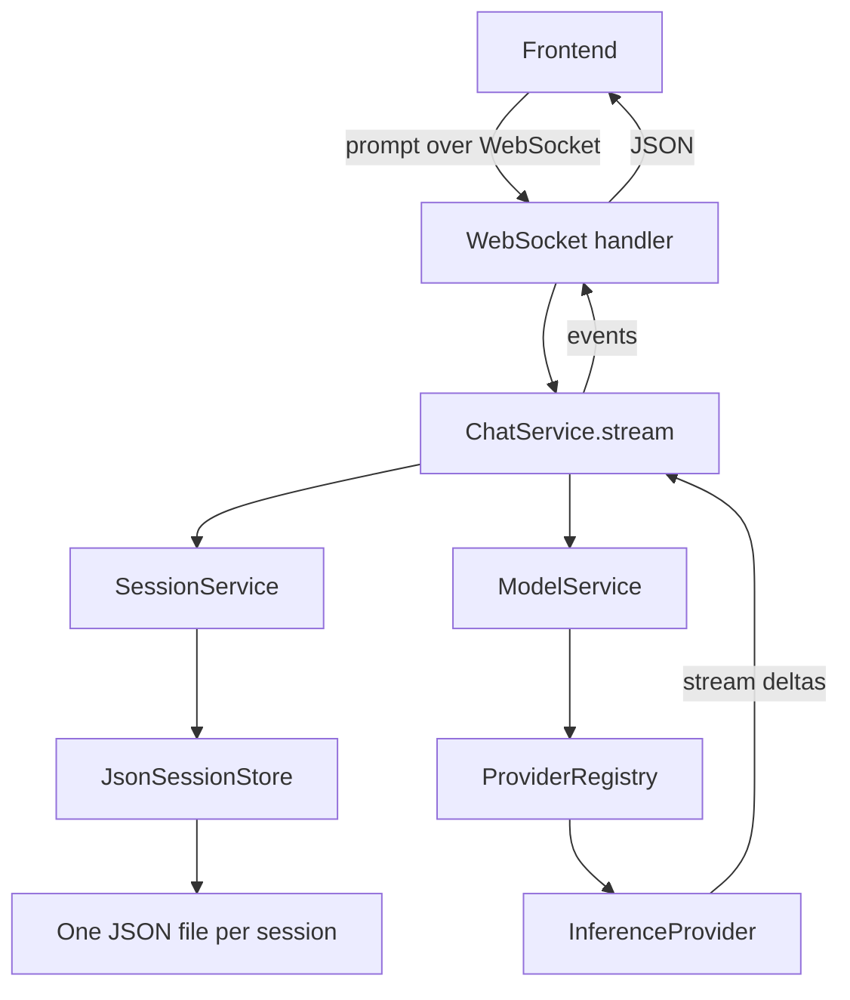

This flow works for one connected chat client. It cannot support a durable agent run after the client disconnects.

## 5. Findings summary

| ID | Severity | Type | Finding |
|---|---|---|---|
| F-001 | Critical | Current defect | A CLI session ID can escape the storage directory and delete another JSON file. |
| F-002 | High | Current defect | The app factory ignores injected provider configuration. |
| F-003 | High | Current defect | The config command stores and prints secrets as normal text. |
| F-004 | High | Architecture blocker | `ChatService` ignores tool-call deltas and reports a tool call as an empty response. |
| F-005 | High | Architecture blocker | A WebSocket connection owns the run lifetime. |
| F-006 | High | Current defect | Concurrent session updates can overwrite each other. |
| F-007 | High | Current defect | Conversation history grows without a context limit. |
| F-008 | High | Architecture blocker | The WebSocket surface lacks authentication, origin checks, limits, and typed input. |
| F-009 | High | Current defect | CI does not run for the documented `development` pull-request flow. |
| F-010 | High | Architecture blocker | Events have no run ID, event ID, sequence number, or replay cursor. |
| F-011 | Medium | Design debt | Domain, persistence, provider, and API models share one model layer. |
| F-012 | Medium | Design debt | Core services create concrete adapters and use hidden config lookup. |
| F-013 | Medium | Current defect | Error mapping is broad, inconsistent, and sometimes leaks provider text. |
| F-014 | Medium | Current defect | Synchronous file work blocks async API handlers. |
| F-015 | Medium | Current defect | Config writes are not atomic and config validation is weak. |
| F-016 | Medium | Design debt | The OpenAI-compatible abstraction claims more compatibility than it can supply. |
| F-017 | Medium | Current defect | Provider clients lack a complete lifecycle, shared timeout rules, and cache rules. |
| F-018 | Medium | Current defect | Logging starts during imports and has no redaction, rotation, or run context. |
| F-019 | Medium | Test gap | High total coverage hides missing integration, security, and concurrency tests. |
| F-020 | Medium | Quality gap | The quality gate omits format checks and changed-code coverage. |
| F-021 | Medium | API debt | Session list responses expose full session objects and use weak pagination. |
| F-022 | Medium | Release debt | Package metadata, release checks, license, and security policy are incomplete. |
| F-023 | Medium | Documentation debt | The repository does not preserve architecture decisions as a maintained system. |
| F-024 | Medium | Current defect | The CLI displays short session IDs that its commands cannot use. |
| F-025 | Low | Design debt | Most Pydantic models accept weak invariants and ignore extra input. |
| F-026 | Low | Current defect | Session timestamps update twice for one message append. |

## 6. Critical and high findings

### F-001: Session storage permits path traversal

**Evidence**

[`GenericStore.load`](../../src/yapa/storage/store.py#L69) and [`GenericStore.delete`](../../src/yapa/storage/store.py#L118) join an unchecked string to the storage path. The CLI passes a raw session ID at [`sessions_delete`](../../src/yapa/cli/app.py#L296).

On Windows and Linux, a value such as `../config` targets `storage/../config.json`. The delete command can therefore delete the main config file. More traversal segments can reach other JSON files.

**Impact**

This is direct local data loss. A future tool or remote client could make the defect more severe.

**Required action**

- Use `UUID` values at the service and repository boundary.
- Reject all non-canonical IDs.
- Resolve each path and make sure it remains below the configured root.
- Reject symlinks and non-regular files where the operation requires a regular file.
- Add regression tests for `..`, absolute paths, separators, alternate separators, and symlinks.

### F-002: The app ignores injected provider configuration

**Evidence**

[`_build_services`](../../src/yapa/api/app.py#L19) receives a `Config`. It uses the config for storage, but it creates `ModelService()` without that config. [`ModelService`](../../src/yapa/services/models.py#L19) then creates `ProviderRegistry` without a config. The registry loads the default config file at [`ProviderRegistry.__init__`](../../src/yapa/providers/registry.py#L21).

**Impact**

`create_app(custom_config)` does not create a fully configured app. Tests, embedded use, and future deployment profiles can use the wrong provider credentials and endpoints.

**Required action**

Build the complete object graph in one composition root. Pass each dependency explicitly. No service or registry should load global configuration during construction.

### F-003: Secret handling is unsafe

**Evidence**

[`ProviderConfig`](../../src/yapa/services/config.py#L30) stores API keys in `config.json`. [`config_set`](../../src/yapa/cli/app.py#L161) prints the supplied value after it saves the config. The config writer does not set restrictive file permissions.

**Impact**

The terminal output can expose a key in scrollback, logs, or captured command output. The config file can expose every provider key to other local processes or users.

OWASP states that secrets must not appear in logs. It also recommends limited visibility, rotation, and revocation. See the [OWASP Secrets Management Cheat Sheet](https://cheatsheetseries.owasp.org/cheatsheets/Secrets_Management_Cheat_Sheet.html).

**Required action**

Create a `SecretStore` port. Use Windows Credential Manager and a suitable Linux keyring when available. Use a permission-hardened fallback for headless Linux. Do not create custom encryption.

Store secret references in normal config. Add `yapa secrets set <provider>` with hidden input. Never print a secret or a secret prefix.

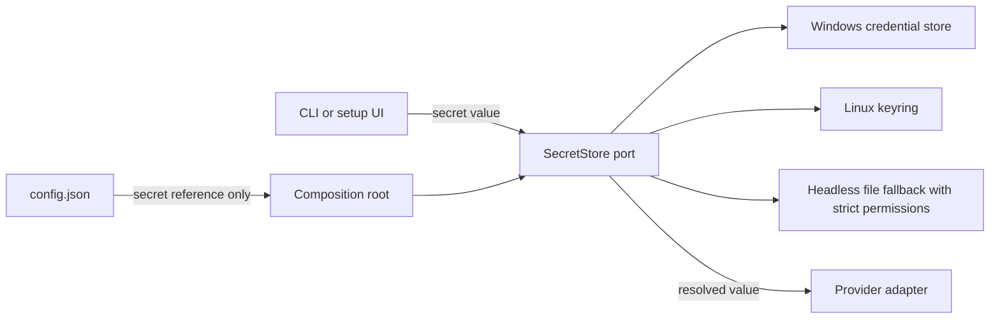

### F-004: The chat loop cannot process tool calls

**Evidence**

The provider emits `ToolCallDelta` objects at [`_stream_chat_impl`](../../src/yapa/providers/openai_compat.py#L187). [`ChatService.stream`](../../src/yapa/services/chat.py#L39) reads text, reasoning, finish reason, and usage only. It ignores `delta.tool_calls`.

A model response with only tool calls leaves `content_buffer` empty. The service then emits `Model returned empty response`.

**Impact**

The current abstractions look tool-ready but are not tool-ready. Adding execution inside this loop would create hidden state and unsafe approval logic.

**Required action**

Replace the single-call chat loop with a run orchestrator. The orchestrator must assemble streamed tool-call fragments, validate arguments, apply policy, persist state, and continue inference after tool results.

### F-005: Transport lifetime owns execution lifetime

**Evidence**

[`chat_websocket`](../../src/yapa/api/websocket/chat.py#L27) calls `chat_service.stream` directly. If the client disconnects during generation, cancellation propagates into the generator. The service persists messages only after the provider finishes.

**Impact**

A disconnect can erase the run record and partial output. An approval request cannot survive a reconnect. A phone or LAN client cannot safely resume work.

**Required action**

Persist a run before execution starts. Execute it under a backend supervisor. Let transports subscribe to stored events.

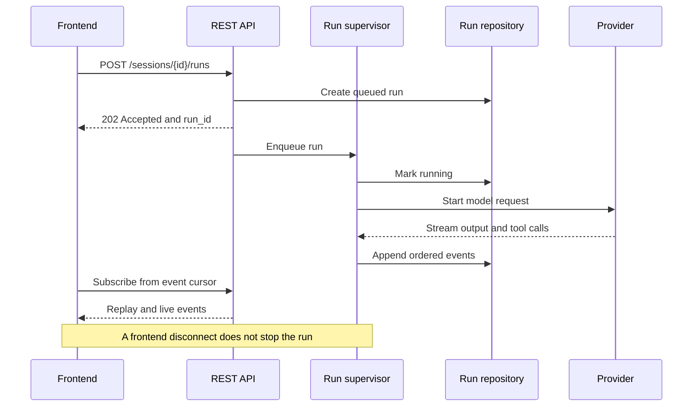

### F-006: Session writes lose concurrent updates

**Evidence**

[`SessionService.add_messages`](../../src/yapa/services/session.py#L67) performs a load, mutation, and full overwrite. The store has no lock or version check. [`GenericStore.save`](../../src/yapa/storage/store.py#L34) also uses one fixed `.tmp` file per entity.

Two runs can load the same session state. The second save can replace the first save. Concurrent temporary writes can also collide.

**Impact**

Parallel runs can lose messages without an error. This failure directly conflicts with the v0.4 concurrency goal.

**Required action**

For v0.2, add repository-specific writes, per-session locks, and optimistic versions. State that v0.2 supports one process only. For v0.3, move durable state to SQLite before broad concurrency.

### F-007: Context grows without a limit

**Evidence**

[`ChatService.stream`](../../src/yapa/services/chat.py#L58) sends every stored message to the provider. It does not use `ModelData.context_length`. Session JSON also grows after each response.

**Impact**

Every long conversation eventually fails at the provider limit. Request cost, latency, memory use, and file-write cost also grow without a bound.

**Required action**

Add a context policy before memory work. The policy must reserve output tokens, estimate input tokens, select recent messages, and define a compaction boundary. Keep memory retrieval separate from raw conversation history.

### F-008: The WebSocket boundary is not safe for tools

**Evidence**

[`chat_websocket`](../../src/yapa/api/websocket/chat.py#L27) accepts every connection. It does not authenticate a client or check the `Origin` header. It parses JSON into a plain object and assumes the object has `.get`. It has no payload, message-rate, connection, idle, or backpressure limit.

The default loopback bind reduces exposure. The CLI still permits `--host 0.0.0.0` without a warning or security check.

**Impact**

This surface cannot safely control executable tools. Browser clients also need explicit origin rules. OWASP recommends authentication, origin allowlists, message validation, payload limits, rate limits, heartbeats, and backpressure. See the [OWASP WebSocket Security Cheat Sheet](https://cheatsheetseries.owasp.org/cheatsheets/WebSocket_Security_Cheat_Sheet.html).

**Required action**

Add a local client token and origin policy before v0.2 tools ship. Refuse non-loopback binds without explicit secure configuration. Add full client pairing and LAN identity in v0.3.

### F-009: The documented branch flow bypasses CI

**Evidence**

[`CONTRIBUTING.md`](../../CONTRIBUTING.md) tells contributors to open pull requests against `development`. Both CI workflows run pull requests only for `master` and `main`.

**Impact**

The normal contribution path can merge code into `development` without lint or tests.

**Required action**

Add `development` to pull-request and push triggers. Protect the branch with required checks.

### F-010: Events cannot support replay or resume

**Evidence**

[`Event`](../../src/yapa/models/event.py#L29) has type, source, and timestamp only. Events do not identify a run, session, position, schema version, or causal tool call.

**Impact**

A client cannot detect a missing event. It cannot resume from a cursor or correlate concurrent runs.

**Required action**

Give every event `event_id`, `run_id`, `sequence`, `occurred_at`, and `schema_version`. Add related IDs when an event belongs to a tool call or approval.

## 7. Architecture findings

### 7.1 Shared models collapse separate contracts

The `models` package mixes domain entities, provider stream data, API payloads, tool calls, and persistence data. FastAPI returns internal `Session` objects directly. JSON storage also serializes those same objects.

One field change therefore changes the API and disk format. This coupling will make pre-v1 changes fast but unsafe. It will also make later compatibility work difficult.

Use separate models for these boundaries:

- Domain state
- Application commands and results
- Provider requests and events
- API requests and responses
- Persistence records

Do not duplicate every field without reason. Map only where a boundary needs an independent contract.

### 7.2 Dependency direction is unclear

`ModelService` imports the concrete provider registry. Providers import service config and executable tools. The service package uses lazy imports to avoid circular imports.

The project can keep a simple ports-and-adapters structure:

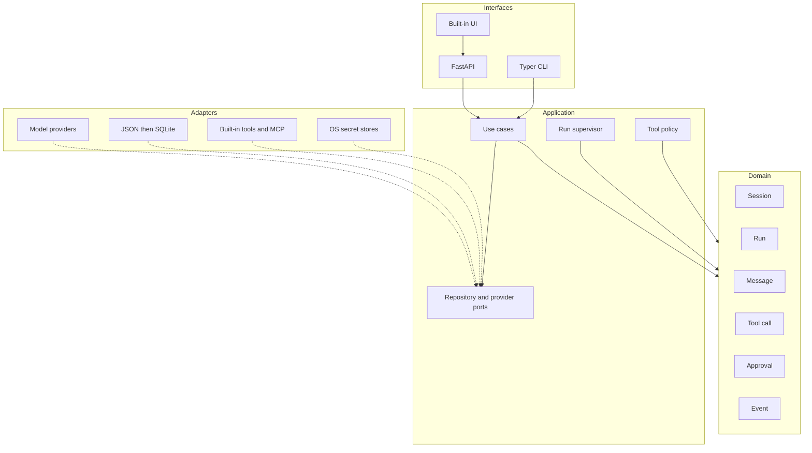

Solid arrows show normal calls. Dotted arrows show adapters that implement inward-facing ports.

### 7.3 Target package direction

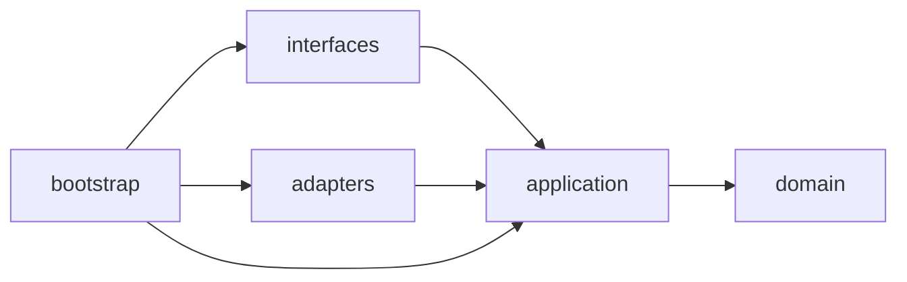

Recommended package groups:

```text
yapa/
  domain/          # entities, value objects, and state rules
  application/     # use cases, orchestration, and ports
  adapters/
    providers/     # OpenAI, OpenRouter, LM Studio, Ollama, vLLM
    persistence/   # JSON and SQLite repositories
    tools/         # built-in tools and MCP client
    secrets/       # credential-store adapters
  interfaces/
    api/           # REST and event streaming
    cli/           # operator commands
  bootstrap/       # config, dependency wiring, and lifecycle
```

This layout is a target, not an instruction for one large rename. Move code only when a feature needs the new boundary.

## 8. Run and tool design requirements

### 8.1 Run state

Do not use full event sourcing. Store current state and an ordered event log. This gives clients replay without making every object depend on event reconstruction.

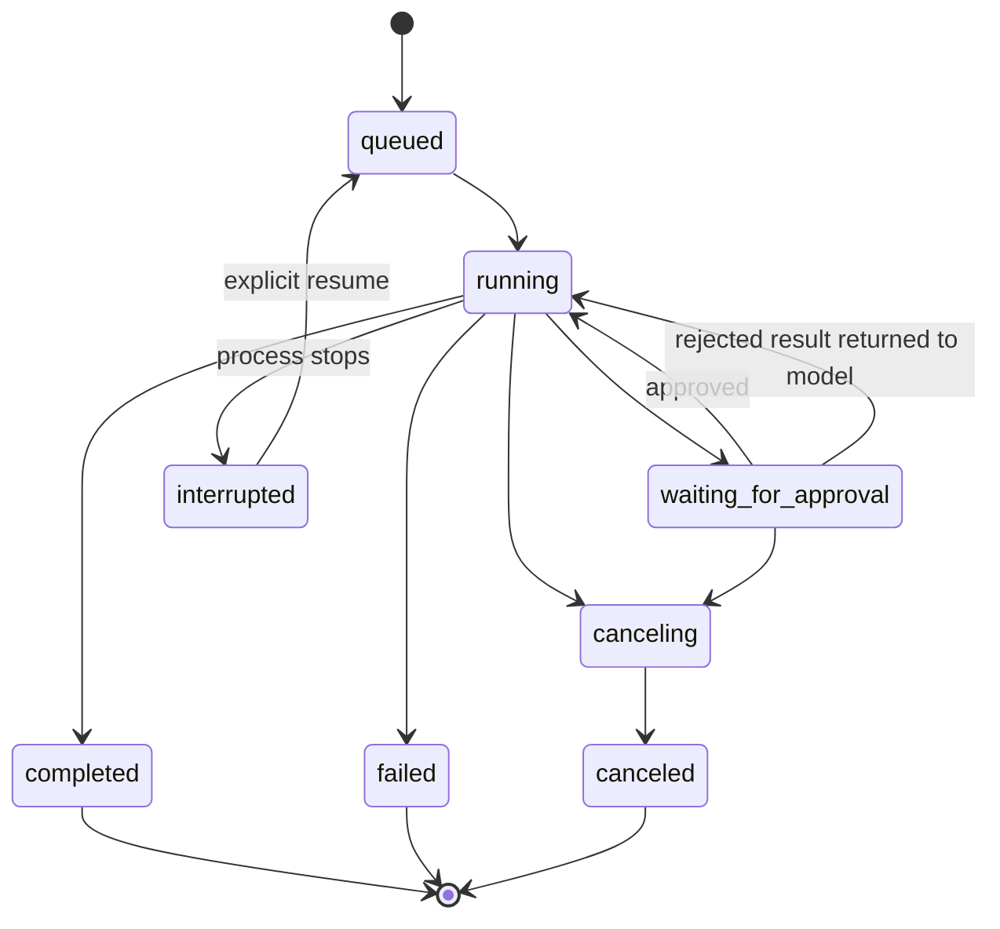

Every transition must have one owner. Repository writes must reject an invalid prior state.

### 8.2 Tool-call and approval state

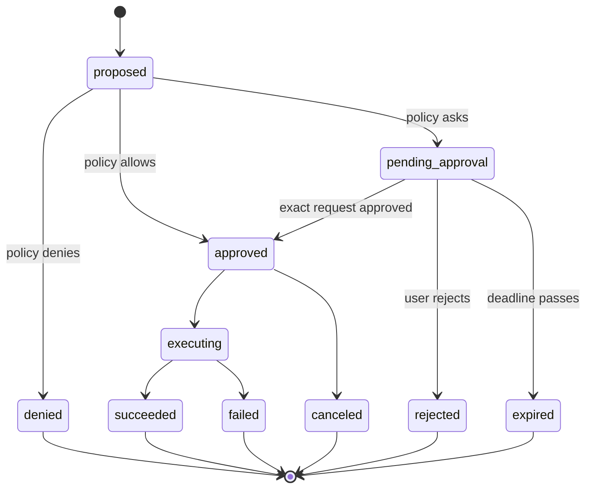

An approval must bind these values:

- Run ID
- Tool-call ID
- Tool name and version
- Canonical argument digest
- Effective permission scope
- Policy version
- Client identity
- Decision time and expiry time

If any bound value changes, YAPA must request a new approval.

### 8.3 Policy and execution are separate

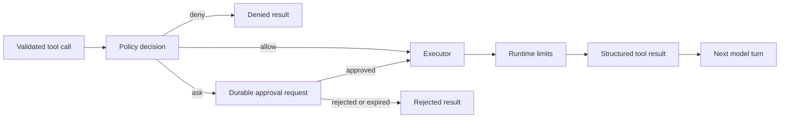

The executor must enforce timeouts, cancellation, output limits, and path scopes. A frontend decision does not bypass the executor.

### 8.4 Built-in tool scope

v0.2.1 should include:

- Calculator
- File list
- File search
- File read
- File write
- File edit

File tools need canonical root checks, symlink rules, byte limits, encoding rules, and atomic writes. Write and edit approvals must show the exact target and proposed change. Bind an edit approval to the prior file hash.

Do not include arbitrary shell execution in v0.2.1.

### 8.5 MCP boundary

MCP support belongs in v0.2.2. The MCP specification uses JSON-RPC, lifecycle negotiation, authorization, and JSON Schema. It also states that tool annotations from untrusted servers are untrusted. See the [MCP overview](https://modelcontextprotocol.io/specification/2025-11-25/basic), [tool specification](https://modelcontextprotocol.io/specification/2025-11-25/server/tools), and [authorization specification](https://modelcontextprotocol.io/specification/2025-11-25/basic/authorization).

MCP tools must enter the same YAPA policy path as built-in tools. An MCP server cannot declare its own tool safe.

## 9. Persistence assessment

### 9.1 Current JSON risks

The current store gives simple atomic replacement on normal writes. It does not give full durability or concurrency safety.

Specific problems include:

- Unchecked path construction
- One fixed temporary filename
- No lock or optimistic version
- Full-session rewrites
- No schema version
- No migration path
- No `fsync` durability rule
- Silent omission of corrupt files during list operations
- Permanent deletes without recovery
- `touch()` before a write that can fail

Session listing loads every full transcript before pagination. Total work grows with all stored conversation content.

### 9.2 Migration path

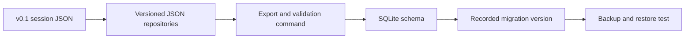

For v0.2, keep JSON but replace `GenericStore` on critical paths with domain repositories. Add `schema_version` and `revision` fields.

For v0.3, use SQLite with foreign keys, write-ahead logging, explicit migrations, and tested backup and restore. Write an architecture decision record before selecting `sqlite3`, `aiosqlite`, SQLAlchemy Core, or Alembic.

## 10. API and protocol assessment

### 10.1 Commands, queries, and events

Use REST for commands and queries. Use WebSocket for subscriptions that need multiplexing. Add Server-Sent Events later if simple browser replay adds value.

Recommended first run resources:

```text
POST   /api/v1/sessions/{session_id}/runs
GET    /api/v1/runs/{run_id}
POST   /api/v1/runs/{run_id}/cancel
GET    /api/v1/runs/{run_id}/events?after={sequence}
POST   /api/v1/tool-calls/{call_id}/decision
WS     /api/v1/events
```

The WebSocket becomes a subscription transport. It does not own a run.

### 10.2 Contract requirements

- Use typed request models for every request.
- Forbid unknown fields on public command models.
- Add a protocol schema version.
- Add stable error codes and RFC 9457 problem responses.
- Add request and correlation IDs.
- Return session summaries from list endpoints.
- Use cursor pagination for growing collections.
- Add optimistic revisions to mutable resources.
- Publish a compatibility policy before v1.0.
- Generate contract fixtures for frontend developers.

### 10.3 Current API defects

The global `ValueError` handler maps all value errors to HTTP 404. This can hide programmer errors and invalid requests. Model listing also turns an unavailable provider into an empty successful list.

The health endpoint always returns `ok`. It does not check storage access or the run supervisor. Add separate liveness and readiness checks when background execution starts.

## 11. Provider assessment

### 11.1 Keep a normalized provider port

The normalized port should describe YAPA needs, not one vendor response shape. It needs:

- Provider capabilities
- Model capabilities
- Normalized input messages
- Tool definitions
- Structured output events
- Usage and finish data
- Cancellation
- Public error categories
- Client shutdown

### 11.2 Split native OpenAI behavior from compatibility behavior

The current provider uses Chat Completions for OpenAI and all compatible services. This limits native OpenAI features and assumes that compatible services accept the same optional parameters.

Official OpenAI documentation recommends the Responses API for reasoning, tool use, and multi-turn workflows. See [OpenAI model guidance](https://developers.openai.com/api/docs/guides/latest-model).

Use a native OpenAI adapter for Responses API features. Keep a separate Chat Completions adapter for LM Studio, Ollama, vLLM, and other compatible servers. Both adapters implement the same YAPA provider port.

### 11.3 Current provider defects

- The common request includes optional values even when they are `None`.
- OpenRouter and LM Studio model-list calls ignore configured timeout and retry values.
- `get_model` can return a fabricated model when a provider does not return the ID.
- Model type uses substring matching.
- The service queries providers in sequence.
- Model metadata has no cache or freshness policy.
- `AsyncOpenAI` clients do not close during app shutdown.
- Provider errors can return raw external text to clients.
- `ChatService` does not persist reasoning, usage, or tool calls from a stream.

Do not fix all of these with a larger base class. Prefer small adapters and shared helper functions where behavior is truly identical.

## 12. Security model

YAPA supports one trusted operator per installation. It is not a multi-tenant boundary. Multiple clients can act for that one operator after authentication.

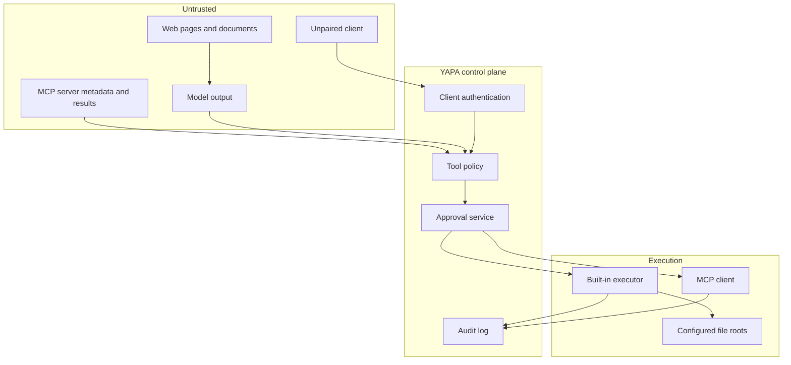

### 12.1 Security rules

- Fail closed when an approval service is unavailable.
- Treat model output as untrusted input.
- Treat MCP descriptions and annotations as untrusted input.
- Keep secrets outside model context and tool output.
- Limit each tool to explicit capabilities and roots.
- Record each policy decision and state transition.
- Redact secrets before log formatting.
- Refuse unsafe remote binds by default.
- Separate read authority from write authority.
- Add expiry to approval requests.
- Make cancellation available at every blocking boundary.

OpenClaw now documents a similar single-operator boundary, loopback default, permission profiles, exact execution approvals, sandbox rules, and permanent log redaction. YAPA should learn from that threat model without copying its product shape. See the [OpenClaw security guide](https://github.com/openclaw/openclaw/blob/main/docs/gateway/security/index.md).

## 13. Logging and operations

### 13.1 Current logging problems

Module imports call `get_logger`, which creates directories and opens files. Importing a library must not create persistent state.

Log files do not rotate or expire. A logger opened before midnight continues to use the old UTC date directory. The log timestamp uses local time while the directory name uses UTC.

Logs have no run ID, request ID, session ID hash, event name, duration, or outcome. They also have no redaction layer.

### 13.2 Target logging model

Configure logging once in the composition root. Libraries must only call `logging.getLogger`.

Use structured event fields:

```text
event_name
level
timestamp
request_id
run_id
tool_call_id
provider_id
model_id
duration_ms
outcome
error_code
```

Do not log prompts, full tool arguments, tool results, credentials, or raw session IDs by default. OWASP lists access tokens, session values, secrets, and sensitive personal data as values to remove or mask. See the [OWASP Logging Cheat Sheet](https://cheatsheetseries.owasp.org/cheatsheets/Logging_Cheat_Sheet.html).

Add these operator commands over time:

- `yapa doctor`
- `yapa status`
- `yapa security audit`
- `yapa data export`
- `yapa data backup`
- `yapa data restore --check`

## 14. Test and quality assessment

### 14.1 Why 94.57 percent is not enough

The test suite gives good unit confidence. It does not test the most important product boundaries.

The API fixture creates the app, then replaces all services in `app.state`. This pattern hides the app factory config defect. The tests also do not cover path traversal, disconnect recovery, concurrent session writes, WebSocket origin checks, or secret output.

The tool package has no tests even though overall coverage remains high. Global statement coverage can hide weak new modules.

### 14.2 Required test layers

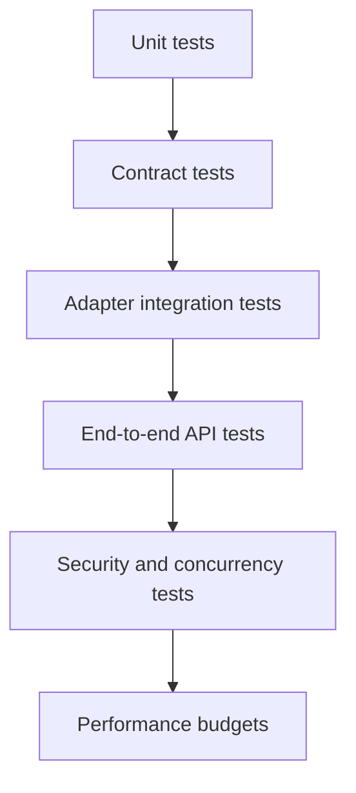

Add these test groups:

- State-machine transition tests
- Property tests for tool-call assembly and path containment
- Real app-lifespan tests with a temporary data root
- Provider contract tests against local mock HTTP servers
- Disconnect and replay tests
- Concurrent update and cancellation tests
- Crash-recovery tests
- Secret-redaction tests
- Built wheel installation tests
- Windows path and Linux symlink tests
- Context-budget tests

Use branch coverage and changed-code coverage. Keep a global threshold, but add stricter thresholds for security and domain modules.

### 14.3 CI corrections

- Run CI on `development`.
- Add `ruff format --check`.
- Use `uv lock --check` or `uv sync --locked` to detect a stale lock file.
- Set default workflow permissions to `contents: read`.
- Add dependency and secret scanning.
- Test the built wheel before release.
- Check that the tag matches the package version.
- Pin third-party actions to reviewed commit SHAs and use Dependabot to update them.

`uv --frozen` only requires a lock file. It does not make sure the lock matches project metadata. The [uv locking guide](https://docs.astral.sh/uv/concepts/projects/sync/) distinguishes `--frozen` from `--locked`.

## 15. API, CLI, and developer experience

### 15.1 CLI defects

The session list prints only the first eight ID characters. The get, rename, and delete commands require the full ID. The displayed value is therefore not usable.

The model-type help mentions `embedding`, but the enum accepts `llm` or `other`. Invalid model types can also escape as unhandled CLI errors.

The CLI file contains server, config, model, and session commands in one module. Split it by command group when tool and run commands arrive.

### 15.2 Frontend developer contract

YAPA can differentiate itself through frontend freedom. Treat API documentation as a product surface.

Supply these assets:

- Versioned OpenAPI output
- Versioned event schema
- Example transcripts for each run state
- Error-code catalog
- Reconnect and replay guide
- Authentication guide
- Approval interaction guide
- Minimal TypeScript client
- Minimal Python client

The built-in UI must use only these public contracts.

## 16. Documentation system

Documentation is part of the architecture for a solo developer and coding agents. The current `AGENTS.md` is useful, but it cannot replace stable design records.

The repository recently removed several thousand lines of design and plan files. The current `.gitignore` also ignores `docs/superpowers/*`. The feature-request template refers to `docs/specs` and `docs/plans`, which do not exist.

Use this documentation layout:

```text
docs/
  architecture/
    overview.md
    domain-model.md
    security-model.md
  adr/
    0001-record-architecture-decisions.md
  protocols/
    runs.md
    events.md
    tools.md
  runbooks/
    backup-and-restore.md
    incident-response.md
    release.md
  roadmap/
    roadmap.md
  audits/
    2026-08-11-foundation-audit.md
```

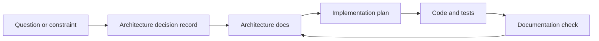

Each architecture decision record must state context, decision, alternatives, consequences, and review conditions. Keep implementation details in code unless a future maintainer needs them to make a decision.

## 17. Packaging and release assessment

The package lacks a license file, project URLs, classifiers, author metadata, and a security policy. The repository also lacks a changelog and code of conduct.

The release workflow creates a draft GitHub release. It does not publish through a trusted package publisher, test the built artifact, generate an integrity attestation, or check the tag against `pyproject.toml`.

Required steps before a public beta:

1. Choose and add a license.
2. Add `SECURITY.md` and a supported-version policy.
3. Complete package metadata.
4. Add a changelog process.
5. Test wheel installation in a clean environment.
6. Use PyPI trusted publishing if YAPA publishes to PyPI.
7. Add artifact hashes or attestations.

The Python Packaging User Guide explains that license files must ship with distributions when the license requires them. See the [licensing guide](https://packaging.python.org/en/latest/guides/licensing-examples-and-user-scenarios/).

## 18. Competitor benchmark

YAPA should not match competitor feature counts. It should use their mature areas as risk evidence.

Hermes Agent already supplies a large tool registry, memory, scheduling, subagents, multiple execution backends, and MCP. Its documentation shows the cost of broad feature scope. See the [Hermes Agent repository](https://github.com/nousresearch/hermes-agent), [tool guide](https://hermes-agent.nousresearch.com/docs/user-guide/features/tools/), and [MCP guide](https://hermes-agent.nousresearch.com/docs/user-guide/features/mcp).

OpenClaw has a mature gateway security model. It documents one trusted operator, loopback defaults, authentication, tool profiles, sandboxing, approval behavior, file permissions, and log redaction.

YAPA's useful distinction is different:

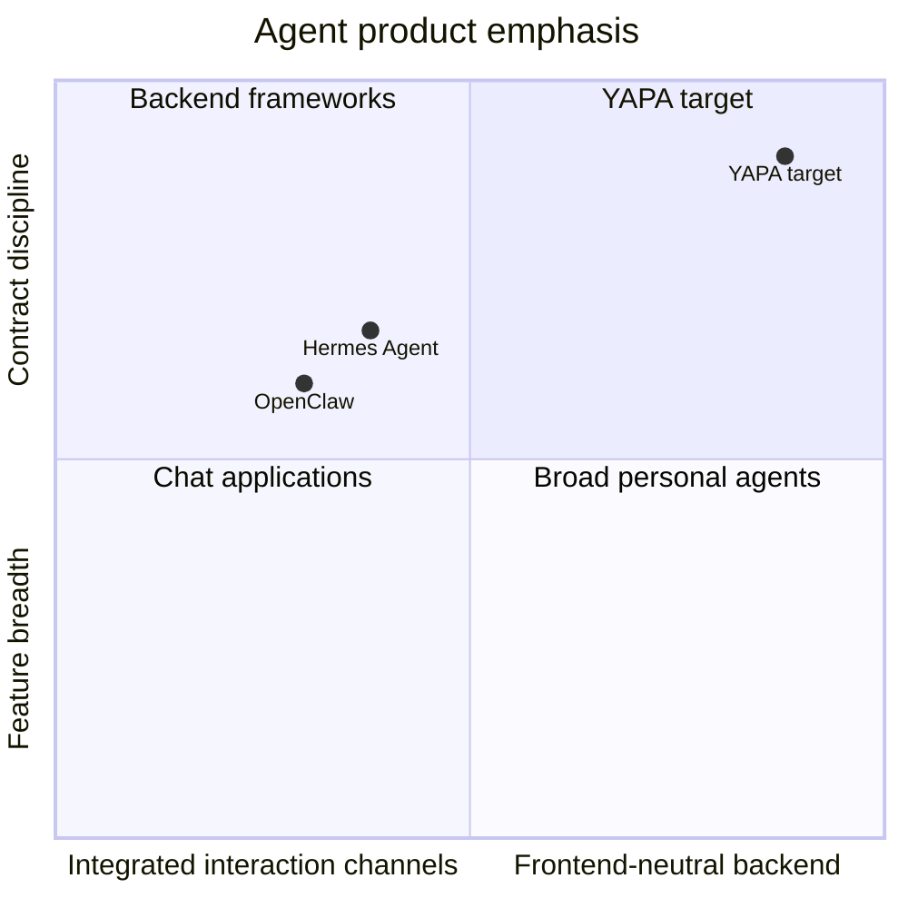

The positions show product emphasis, not quality scores.

YAPA should expose agent capabilities through stable frontend contracts. It should compete on safety, portability, and extension clarity.

## 19. Recommended roadmap

The roadmap uses small outcomes. Version numbers can change after implementation plans expose more dependencies.

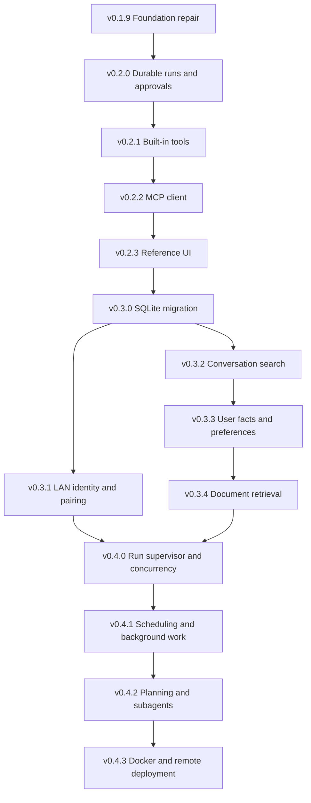

### v0.1.9: Foundation repair

Scope:

- Fix path traversal.
- Fix app config wiring.
- Stop secret output.
- Add strict config validation and atomic writes.
- Add CI for `development`.
- Add format checks.
- Add logging composition and redaction foundation.
- Add project license and security policy decisions.
- Start architecture decision records.

Exit criteria:

- Security regression tests pass on Windows and Ubuntu.
- A real app-lifespan integration test passes.
- No command prints a secret.
- CI protects the documented branch flow.

### v0.2.0: Durable runs and approval control

Scope:

- Add run, tool-call, approval, and event domain models.
- Add a single-process run supervisor.
- Persist runs and ordered events in versioned JSON.
- Add run create, query, cancel, event, and decision APIs.
- Add local client authentication and WebSocket origin rules.
- Add the provider tool-call continuation loop.
- Add timeouts, cancellation, and output limits.

Exit criteria:

- A run survives frontend disconnect and reconnect.
- An approval survives frontend disconnect and process restart.
- An altered tool call cannot use an old approval.
- Invalid transitions fail closed.
- Concurrent runs do not lose session data within one process.

### v0.2.1: Built-in tools

Scope:

- Calculator
- Bounded file list, search, and read
- Approval-gated file write and edit
- Tool schema and result contracts
- Path, symlink, size, timeout, and output controls

Exit criteria:

- Every tool has policy, security, contract, and platform tests.
- Windows and Ubuntu use the same observable contract.
- File writes cannot escape configured roots.

### v0.2.2: MCP client

Scope:

- STDIO and HTTP transport evaluation
- Capability negotiation
- Tool discovery and filtering
- Shared YAPA approval path
- Secure credential storage
- Server trust and enablement model

Exit criteria:

- MCP annotations never grant authority.
- Disabled tools cannot execute.
- Remote authorization tokens bind to the intended server.
- A failed MCP server cannot stop built-in tools.

### v0.2.3: Reference UI

Scope:

- Session and run views
- Live event stream
- Approval view with exact arguments
- Reconnect and replay
- Local client setup

Exit criteria:

- The UI uses only public APIs.
- A third-party frontend can reproduce every UI action.

### v0.3.x: Durable data, identity, and memory

Sequence:

1. Migrate JSON data to SQLite.
2. Add client identity and pairing for LAN use.
3. Add full-text conversation search.
4. Add durable facts and preferences.
5. Add document ingestion and semantic retrieval.

Memory needs provenance, confidence, update rules, deletion, and user inspection. Do not let the model write permanent facts without a review policy.

### v0.4.x: Concurrency and autonomous work

Sequence:

1. Add a persistent job queue and resource governor.
2. Add scheduled and background runs.
3. Add planning and subagent execution.
4. Add Docker and supported remote-access guidance.
5. Complete multi-client concurrency, recovery, and backpressure.

## 20. Architecture decision record backlog

Create these decisions before the related implementation:

| ADR | Decision |
|---|---|
| ADR-001 | Adopt a modular monolith with ports and adapters. |
| ADR-002 | Define run state and event persistence. |
| ADR-003 | Define backend-owned tool policy and approval binding. |
| ADR-004 | Define local authentication and frontend trust. |
| ADR-005 | Define the secret-store chain and headless fallback. |
| ADR-006 | Define provider capability normalization. |
| ADR-007 | Select the SQLite library and migration system. |
| ADR-008 | Define context budgeting and compaction. |
| ADR-009 | Define memory provenance and deletion rules. |
| ADR-010 | Define remote deployment and client pairing. |

## 21. Definition of done for future milestones

A milestone is done only when all applicable items pass:

- The domain rules and failure states are documented.
- An architecture decision record exists for a new system boundary.
- Public request, response, event, and error contracts are versioned.
- Unit, contract, integration, security, and platform tests pass.
- Logs contain useful context and no sensitive content.
- Cancellation and timeout behavior is tested.
- Data migration and rollback behavior is documented.
- Windows and Ubuntu pass in CI.
- The built artifact passes a clean installation test.
- The user and operator docs match behavior.
- The roadmap records deferred work.

## 22. Final assessment

YAPA does not need a rewrite. It needs a controlled transition from chat orchestration to durable agent execution.

The current service and provider layers give that transition a useful base. The most important change is to make state, authority, and contracts explicit. Once YAPA owns those three concerns, tools, memory, scheduling, and subagents can grow without turning the project into an unsafe collection of loops.

The correct next implementation target is v0.1.9 foundation repair. After that work, v0.2 can build tool execution on a stable base.

## 23. Source index

Primary external sources used in this audit:

- [Official OpenAI model guidance](https://developers.openai.com/api/docs/guides/latest-model)
- [Model Context Protocol overview](https://modelcontextprotocol.io/specification/2025-11-25/basic)
- [Model Context Protocol tools](https://modelcontextprotocol.io/specification/2025-11-25/server/tools)
- [Model Context Protocol authorization](https://modelcontextprotocol.io/specification/2025-11-25/basic/authorization)
- [OWASP WebSocket Security Cheat Sheet](https://cheatsheetseries.owasp.org/cheatsheets/WebSocket_Security_Cheat_Sheet.html)
- [OWASP Secrets Management Cheat Sheet](https://cheatsheetseries.owasp.org/cheatsheets/Secrets_Management_Cheat_Sheet.html)
- [OWASP Logging Cheat Sheet](https://cheatsheetseries.owasp.org/cheatsheets/Logging_Cheat_Sheet.html)
- [OpenClaw security guide](https://github.com/openclaw/openclaw/blob/main/docs/gateway/security/index.md)
- [Hermes Agent repository](https://github.com/nousresearch/hermes-agent)
- [Hermes Agent tool guide](https://hermes-agent.nousresearch.com/docs/user-guide/features/tools/)
- [Hermes Agent MCP guide](https://hermes-agent.nousresearch.com/docs/user-guide/features/mcp)
- [uv lock and sync guide](https://docs.astral.sh/uv/concepts/projects/sync/)
- [Python packaging license guide](https://packaging.python.org/en/latest/guides/licensing-examples-and-user-scenarios/)
